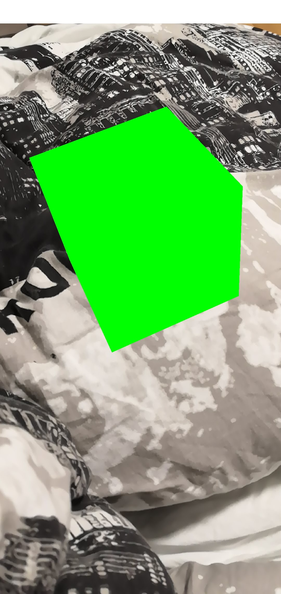
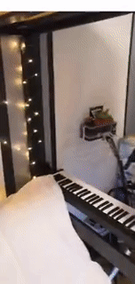

# webxr three.js AR
This project aims to help you use Three.js with WebXr to create an Augmented Reality APP easily

## Context
Some time ago, I read about WebArOnArCore, and I thought it could be cool to try to add some augmented reality to my website. But the main issue was that nobody would want to install a custom web browser just to see it.
So I waited, and I waited, and it arrived ! WebXr now supports Augmented Reality in Google Chrome mobile.
  I think it could be cool to have more people developing AR components on their websites, so I decided to create a simple starter kit, with some abstraction over the still quite complex WebXr API to allow more people to develop their experiences.

## Installation
First Generate a self-signed certificate in order to be able to test the AR app, because AR session require to be served by https. You will see a warning message because the certificate is self-signed, ignore it.
```sh
openssl req -newkey rsa:4096 \
            -x509 \
            -sha256 \
            -days 3650 \
            -nodes \
            -out server.cert \
            -keyout server.key

```

Install the dependencies
```javascript
npm install
```

Run the project with webpack-dev-server, it will reload the project as soon as a change is detected so you can debug in real-time.
```javascript
webpack-dev-server --config webpack.config.js --port 3000 --hot --host 0.0.0.0
```

## Features
I provide a arHelper class, that will do a lot of abstraction for you to be able to setup new AR project easily. This class provides :

```javascript
- ArHelper(context)
// The constructor is called with the context of the class that instantiate.
// It needs to implement three methods :
    - onFrame(time, frame, pose){}
    // this method will be called before each render of the Three scene, the main logic of your app should be here.
    - onTouchStart(event){}
    // Screen pressed event
    - onTouchEnd(event){}
    // Screen released event

- ArHelper().getThreeScene()
// get the Three.JS scene

- ArHelper().isDown()
// check if the screen is currently pressed

- async ArHelper().getHits(frame)
// request hit test for the frame: returns  all the position matrix (THREE.Matrix4) of intersected planar surfaces (ground, walls or any other planar surfaces).

- ArHelper().getProjectionMatrix(frame)
// returns the projectionMatrix
```

## Example
Out of the box the project comes with an example : MyArScene.js
- Click on the Start AR button
- The AR session starts
- Move your phone over the ground in order to detect planar surface.
- Click on the screen
- A green box appears on the ground



## Online Demo:
If you want to see what I have done starting from this project: <br/>
Go to my personal website, and click the top banner to start the AR experience (yes it is in french :/)
[https://boehm-e.github.io/](https://boehm-e.github.io/) <br/><br/>




## Credit
Don't hesitate to contact me if you have any questions at : erwan.boehm@gmail.com
[Erwan BOEHM](https://boehm-e.github.io/)
